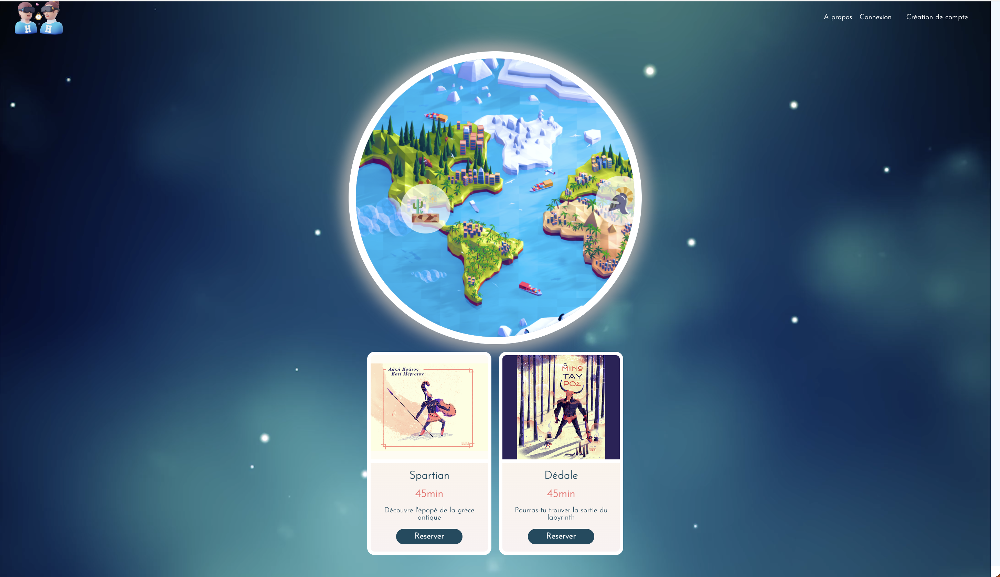

 

  <h1 align="center">Hack In TimeVr</h1>

  

    Our team participated in a 24-hour hackathon organized by the Wild Code School with a travel theme. We created a unique platform that allows users to book a virtual reality session, traveling through different historical scenes and landmarks. Explore the world like never before with our innovative solution!
     
     
    <a href="">View Demo</a>
  

## About The Project

Our team participated in a hackathon organized by the Wild Code School with the theme of travel. We were given 24 hours to create a unique project that would revolutionize the way people travel. After much brainstorming and ideation, we came up with a novel idea - a platform that allows users to book virtual reality sessions, traveling through different historical scenes and landmarks.

The platform we developed is a one-of-a-kind solution that offers an immersive and interactive experience to users. With the help of virtual reality technology, users can explore different parts of the world like never before. They can visit historical landmarks, meet famous personalities, and even travel back in time.

Our team worked tirelessly for 24 hours to bring this project to fruition. We created a user-friendly interface, seamless booking system, and engaging content that will keep users hooked. We believe that our platform has the potential to change the way people travel, making it more accessible, affordable, and sustainable.

In conclusion, our hackathon project is a testament to our team's creativity, innovation, and commitment. We are proud to present our solution and hope that it will inspire others to push the boundaries of technology and travel.

## Built With

* React [React](https://fr.reactjs.org/)

## Authors

* **Charline Vergoz** - [Charline Vergoz](https://github.com/CV418)
* **Maxime Faure** - [Maxime Faure](https://github.com/Milimaks)
* **Rosbain** - [Rosbain](https://github.com/russenbissemo)
* **Jonathan Bonhoure** - [Jonathan Bonhouse](https://github.com/SkullZRulZ)
* **Léon** - [Léon](https://github.com/Jesuisleon)

